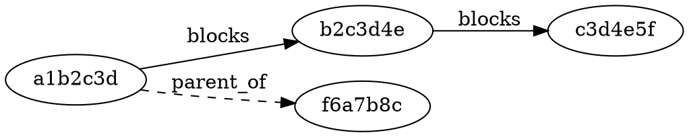

# Dependency Graph & Topological Sort Design

## Summary

Add a dependency graph to git-issue with four relationship types, an eagerly-maintained edge index backed by git notes, topological sorting via POSIX `tsort`, automatic blocked-state management, and text/DOT graph output.

## Data Model

### Issue Header Fields (Source of Truth)

Four new comma-separated fields in the issue front matter:

```
blocks: d4e5f6a,e5f6a7b
depends_on: b2c3d4e
parent_of: f6a7b8c,a7b8c9d
relates_to: c3d4e5f
```

- `blocks` -- this issue must complete before the listed issues can start
- `depends_on` -- inverse of blocks; this issue cannot start until listed issues complete
- `parent_of` -- epic/parent containing listed sub-issues (no blocking semantics)
- `relates_to` -- informational link (no blocking semantics)

`blocks` and `depends_on` are maintained as a consistent pair: adding A blocks B writes `blocks: B` on A and `depends_on: A` on B.

### Derived Edge Index

Stored at `refs/notes/dep-graph`. One edge per line:

```
a1b2c3d blocks b2c3d4e
b2c3d4e depends_on a1b2c3d
a1b2c3d parent_of f6a7b8c
c3d4e5f relates_to d4e5f6a
```

Includes a `last_rebuilt_from:` marker to track which note state the index was derived from.

### Reconciliation

Headers are always the source of truth. The edge index is derived.

- **Writes** (`dep add`, `dep rm`) update both headers and edge index immediately.
- **Reads** (`ready`, `topo`, `deps`) check which issue notes changed since the last edge index rebuild by diffing against the marker. Changed issues are re-parsed and their edges updated before executing the query.
- **`dep rebuild`** performs a full rebuild from all headers as a repair tool.
- **`import`** triggers incremental rebuild automatically since imported issues appear as newly modified notes.

## Commands

### Dependency Management

| Command | Action |
|---|---|
| `git issue dep add <from> <type> <to>` | Add dependency edge |
| `git issue dep rm <from> <type> <to>` | Remove dependency edge |
| `git issue dep list [<id>]` | Show deps for one issue or all edges |
| `git issue dep rebuild` | Regenerate edge index from all issue headers |

### dep add Side Effects

1. Writes the edge to both issue headers (bidirectional for blocks/depends_on).
2. Appends edge to the dep-graph note.
3. If type is `blocks` and the target is not `done`, sets target state to `blocked`.
4. Runs cycle detection via `tsort` before committing. Rejects if the edge creates a cycle.

### dep rm Side Effects

1. Removes from both headers.
2. Removes from edge index.
3. If the target has no remaining unresolved blockers, sets state from `blocked` to `open`.

### Graph Queries

| Command | Action |
|---|---|
| `git issue ready` | List issues with no open blockers, sorted by priority |
| `git issue topo` | Topological ordering of all non-done issues via `tsort` |
| `git issue deps [--dot]` | Text tree of dependency graph; `--dot` emits Graphviz DOT |
| `git issue deps <id> [--dot]` | Dependency tree rooted at a specific issue |

### State Auto-Management

When `git issue update <id> --state=done` is called:

1. Find all issues where `depends_on` includes the completed issue.
2. For each, check if all other blockers are also `done`.
3. If yes, set that issue's state from `blocked` to `open`.
4. Print what was unblocked.

## Topological Sort

Uses POSIX `tsort`. Blocking edges are extracted from the edge index and piped directly:

```bash
grep ' blocks ' "$edge_file" | awk '{print $1, $3}' | tsort
```

`tsort` detects cycles and reports them to stderr, giving cycle detection for free on both `dep add` validation and `topo` output.

Issues at the same topological level are secondarily sorted by priority, then creation date.

## Output Examples

### ready

```
Ready to work on:
#b2c3d4e [open]    Add OAuth provider   (P: critical) -> You
#d4e5f6a [open]    Write unit tests     (P: high)     -> Unassigned
#f6a7b8c [open]    Update README        (P: medium)   -> You
```

### topo

```
Topological order (do these in sequence):
1. #a1b2c3d  Fix auth middleware     (P: critical)
2. #b2c3d4e  Add OAuth provider      (P: critical)  <- blocked by #a1b2c3d
3. #c3d4e5f  Integration tests       (P: high)      <- blocked by #b2c3d4e
```

### deps --dot



## Testing

### Unit Tests (tests/test_deps.sh)

- Add/remove each of the four dependency types
- Bidirectional header consistency (A blocks B implies B depends_on A)
- Cycle detection rejects direct cycles (A blocks B, B blocks A)
- Cycle detection rejects transitive cycles (A->B->C->A)
- dep rm removes from both sides
- Multiple deps on one issue (comma-separated round-trip)
- Dep on nonexistent issue ID is rejected
- Self-dependency is rejected

### State Auto-Management Tests

- `dep add A blocks B` when A is open sets B to `blocked`
- Mark A as `done` unblocks B to `open`
- B has two blockers (A, C): mark A done, B stays blocked; mark C done, B unblocks
- `dep rm` of the last blocker unblocks the target

### Graph Query Tests

- `ready` returns only issues with no unresolved blockers and state != done
- `topo` output matches expected ordering for a known graph
- `topo` on a graph with no deps returns all issues sorted by priority
- `deps --dot` output is valid DOT syntax
- `deps <id>` shows only the subgraph reachable from that issue

### Incremental Rebuild Tests

- Manual header edit with `depends_on:` is picked up on next read
- Import with dep fields produces consistent graph
- `dep rebuild` from scratch matches incrementally-maintained index

### Benchmark Harness (tests/bench_deps.sh)

Generates N issues with random blocking dependencies (default 500). Times `ready`, `topo`, `deps`, and `dep rebuild`. Targets: `ready` under 100ms for 500 issues, `topo` under 200ms.
